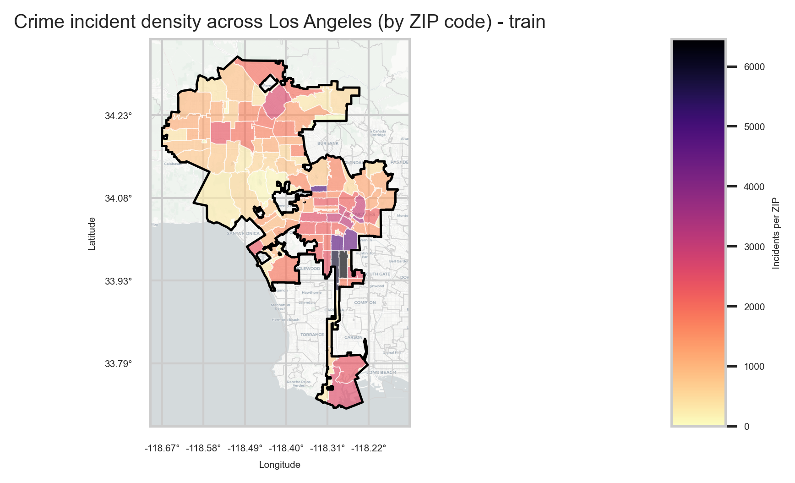
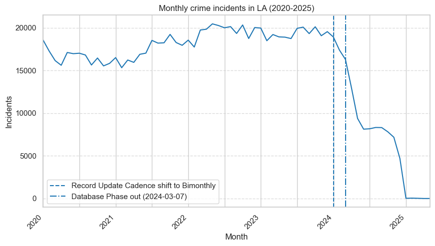
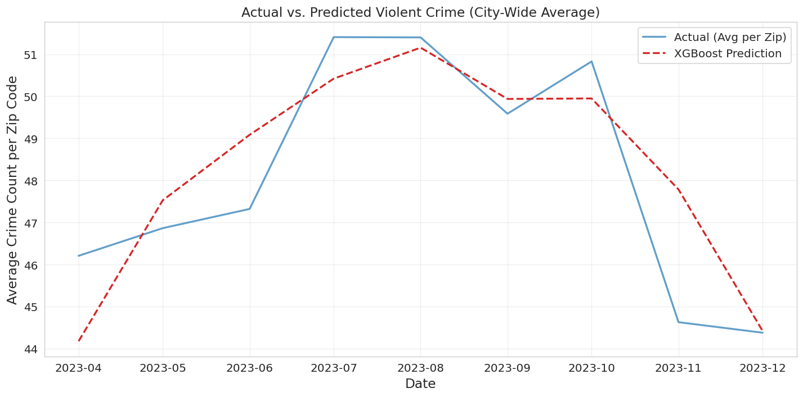
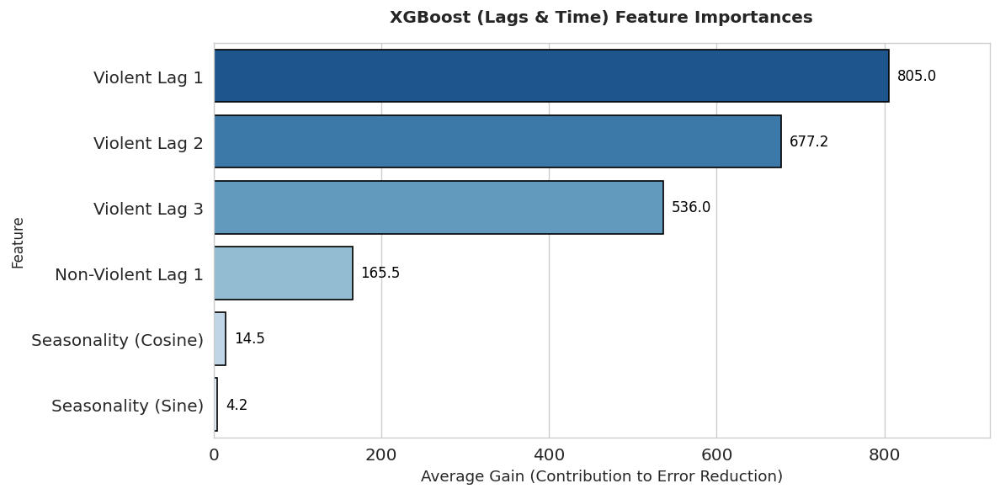
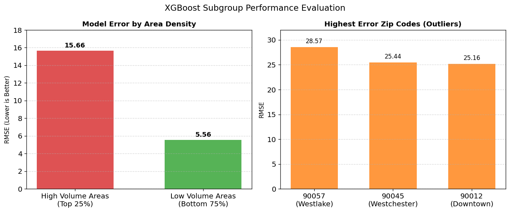

# LA Violent Crime Forecasting

Forecasting monthly violent crime counts for each ZIP code in Los Angeles, using LAPD incident data and Census socioeconomic indicators.

UC Berkeley MIDS, DATASCI 207 final project. Full write-up: [final report](report/final_report.pdf).

<p align="center">
  
</p>

## Summary

- **Task:** predict next month's violent crime count for each of 149 LAPD ZIP codes.
- **Best model:** XGBoost on lagged crime counts and month encodings. Test RMSE 9.79, or about 10 incidents per ZIP per month.
- **Main finding:** recent crime history beats demographics. Adding income, poverty, unemployment and Gini features made the models generalize worse.
- **Limitation:** error is about 3x higher in high-volume ZIP codes such as Westlake (90057), where spikes are not explained by the previous three months.

## Data

| Source | Use |
|---|---|
| [LAPD Crime Data, 2020 to present](https://catalog.data.gov/dataset/crime-data-from-2020-to-present) | ~1M incident records with coordinates, crime description, weapon code |
| [ACS 2023 5-year estimates](https://data.census.gov/) | Population, median income, poverty rate, unemployment rate, Gini index per ZIP |
| [Census TIGER ZCTA shapefiles](https://www.census.gov/geographies/mapping-files/time-series/geo/tiger-line-file.2023.html) | Spatial join from incident coordinates to ZIP code |

Preprocessing steps:

1. Label incidents as violent using the weapon code or a match to UCR/COMPSTAT definitions (murder, rape, robbery, aggravated assault).
2. Aggregate to ZIP-month counts and fill missing ZIP-month pairs with zeros.
3. Add 1, 2 and 3 month lags plus sine/cosine month encodings.
4. Split by time: train Apr 2020 to Jun 2022, validation Jul 2022 to Mar 2023, test Apr 2023 to Dec 2023.

Data after 2023 is excluded. LAPD switched reporting systems (UCR to NIBRS) in early 2024 and reported incidents drop sharply.

<p align="center">
  
</p>

## Results

| Model | Train RMSE | Val RMSE | Test RMSE | Test MAE |
|---|---|---|---|---|
| Linear Regression (3-month lag average) | 10.78 | 10.07 | 11.16 | 7.30 |
| Random Forest (socioeconomic + lags) | 6.99 | 9.55 | 9.85 | 6.33 |
| Random Forest (lags + time) | 7.07 | 9.68 | 10.22 | 6.52 |
| XGBoost (socioeconomic + lags) | 9.34 | 9.27 | 10.13 | 6.58 |
| **XGBoost (lags + time)** | 8.95 | 9.74 | **9.79** | 6.36 |

XGBoost with lags and time was chosen as the final model. It has the lowest test RMSE and a much smaller train/test gap than Random Forest (0.84 vs 2.86).

<p align="center">
  
</p>

### Insights

**Lagged counts carry almost all of the signal.** Each lag correlates with the current month at r = 0.96 to 0.97. Socioeconomic variables top out around |r| = 0.55. Feature importance in the final model tells the same story.

<p align="center">
  
</p>

**Error concentrates in hotspots.** RMSE is 5.56 in the bottom 75% of ZIP codes by volume and 15.66 in the top 25%. The worst ZIP codes are Westlake, Westchester and Downtown.

<p align="center">
  
</p>

**Next steps:** add leading indicators (events, weather, 911/311 calls) and move to a finer spatial unit such as census blocks.

## Repo structure

```
notebooks/
  data_prep/   ACS download, cleaning, spatial join, feature engineering, splits
  eda/         exploratory analysis, one notebook per author
  models/      linear regression, random forest and XGBoost experiments
data/
  map_data/    LA city boundary and ZIP code shapefiles
  raw/         ACS table notes (large CSVs are not tracked)
figures/       plots used in the report and this README
report/        proposal, milestone and final report PDFs
```

## Running it

1. Download the LAPD CSV from the link above into `data/raw/`.
2. Set `CENSUS_API_KEY` in your environment ([free key](https://api.census.gov/data/key_signup.html)).
3. Run `notebooks/data_prep/download_acs.ipynb`, then `preprocessing.ipynb`. This writes `train.csv`, `validation.csv` and `test.csv` to `data/processed/`.
4. Run any notebook in `notebooks/models/`. The final model is in `xgboost_mo.ipynb`.

Data paths in the notebooks are relative to the repo root, so set that as the working directory. Notebooks were written by different authors and a few use their own paths, so check the first cells before running.

Main dependencies: pandas, geopandas, scikit-learn, xgboost, tensorflow, matplotlib, seaborn.

## Authors

Kadin Wilkins, Matilda Orona, Vikram Magal, Anushka Vazirani
